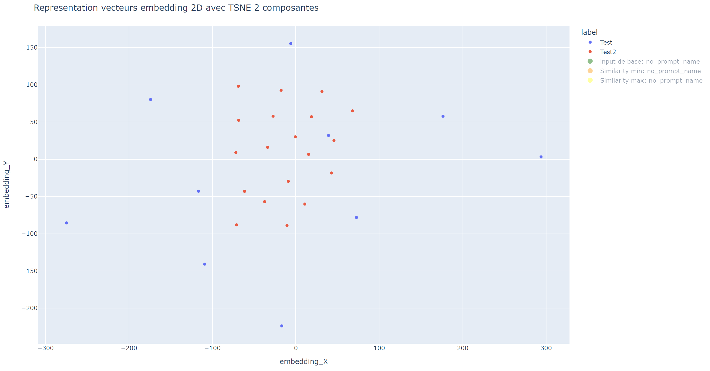
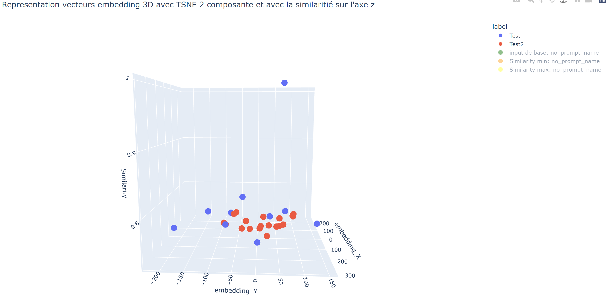
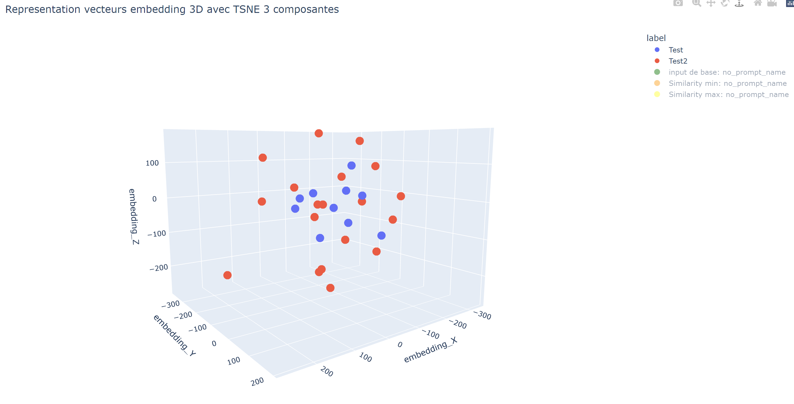

# PS5_DIFUM_VISU

> Original author of the project: Biolley Valentin

Ce guide a pour but de démontrer l'utilisation du module de visualisation PS5_DIFUM_VISU qui se trouve sur le repository git suivant : https://gitlab.forge.hefr.ch/valentin.biolley/ps5_difum_module_visu


### Structure:
Ce module de visualisation regroupe les résultats des travaux faits dans le notebook suivant: https://gitlab.forge.hefr.ch/valentin.biolley/detecteur_incendie_ou_de_fumee_utilisant_les_foundation_models/-/blob/main/src/Grounding_dino_simple_NB/PS5_DFUM_VISU.ipynb?ref_type=heads

Différents labels utilisés pour les tests se trouvent dans le dossier "file"
ainsi que des images de tests se trouvent dans le dossier "images_fire_not_fire"

Ensuite, ce module met à disposition des outils permettant de manipuler les vecteurs d'embeddings. La documentation des entrées sorties de chacune de ces fonctions se trouvent dans le notebook.

Voici quelques méthodes utiles pour la générer les données nécessaires à la visualisation :


- read_file_label
- read_dir_image
- get_img_embedding
- get_txt_embedding
- create_data_set_for_vis
- visualise_embedding
#### Modularité du module
Pour que le module soit le plus modulable possible, le module utilise des classes génériques permettant de prendre en entrée n'import quel modèle permettant la génération des embeddings de text ou d'image, il existe une classe générique pour le text et une pour les images, respectivement MyModel_text et MyModel_img. 

Il y a 3 méthodes abstraites à implémenter :
* get_img_embedding
* get_txt_embedding
* tokenize_labels


## Getting started
### Installation du module
Pour pouvoir installer le module de visualisation, il faut le charger depuis le repository git grâce à la commande suivante :
```bash
pip install git+https://gitlab.forge.hefr.ch/valentin.biolley/ps5_difum_module_visu
```
### Import du module
Voici comment importer le module pour pouvoir l'utiliser.
```python
from PS5_DIFUM_VISU import PS5_DIFUM_VISU as PS5
```

### Exemple d'utilisation basique du module de visualisation
Voici un exemple basique d'utilisation du module. Dans cet exemple 2 tenseurs sont générés aléatoirement et 2 labels sont ajoutés pour différencier les 2 tenseurs. Puis, les données sont calculées et les graphiques générés.
```python
from PS5_DIFUM_VISU import PS5_DIFUM_VISU as PS5
# compute random tensor for example
embeddings_1 = PS5.torch.rand((10, 100, 400))
embeddings_2 = PS5.torch.rand((19, 100, 400))
# Classe of point (color on graphe)
labels=["Test","Test2"]
all_embeddings=[embeddings_1,embeddings_2]
# create dataset to simplify generation of graphe
data_to_visu = PS5.create_data_set_for_vis(all_embeddings,label=labels)
# generate graphe with dataset
PS5.visualise_embedding(data_to_visu)

```
#### Résultats attendus
Le module génère trois graphiques différents :

Une représentation des vecteurs d'embeddings dans l'espace 2D

Une représentation des vecteurs d'embeddings dans l'espace 3D avec sur l'axe Z la similarité cosinus

Une représentation des vecteurs d'embeddings dans l'espace 3D

